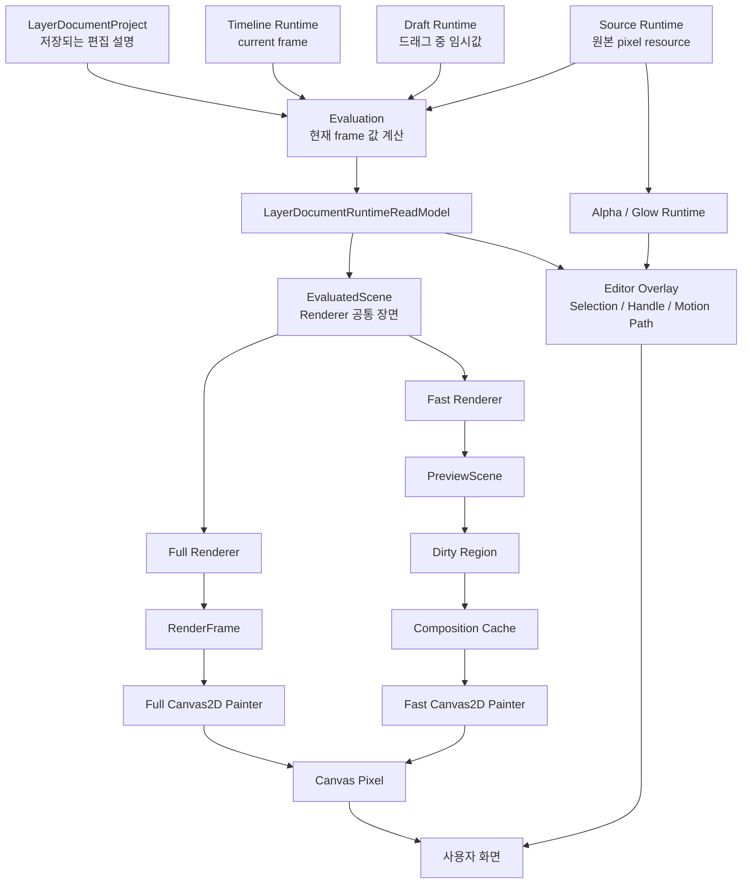
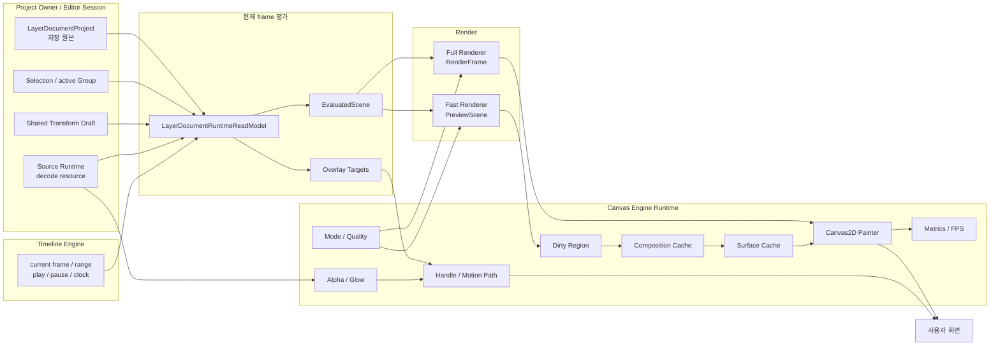

# Render Runtime Bible

> 문서 번호: 61
> 상태: 현재 제품 코드 조사 완료 / 구현·리팩토링 미실행
> 기준일: 2026-07-26
> 대상 독자: Render를 처음 접하는 프로젝트 설계자와 비개발자
> 목적: Render와 조금이라도 관련된 Runtime의 역할, 소유권, 수명,
> 사용 관계와 현재 사용 여부를 한 문서에서 이해한다.
> 현재 canonical Render 설계는
> `docs/architecture/11_render_architecture.md`를 따른다.

---

# 1. Render란 무엇인가

## 1.1 아주 쉬운 설명

Project에 저장된 Layer Document는 그림 자체가 아니라 **편집 설명서**에
가깝다.

예를 들어 Project에는 다음과 같은 내용이 저장된다.

- 어떤 원본 PSD를 사용하는가
- 화면의 어느 위치에 있는가
- 크기와 회전은 얼마인가
- 몇 번째 Layer인가
- 현재 frame에서 어떤 animation 값을 가지는가

하지만 사용자는 이 숫자와 문서를 직접 보는 것이 아니라 실제 그림을
봐야 한다.

Render는 이 편집 설명서를 읽고 현재 frame의 실제 화면을 만드는 과정이다.

```text
편집 설명서
  → 현재 frame의 값 계산
  → 그릴 장면 정리
  → 그리기 명령 생성
  → Canvas에 그림
```

영화 제작에 비유하면 다음과 같다.

- `LayerDocumentProject`: 촬영 대본과 편집 지시서
- `Source Runtime`: 실제 촬영 원본이 보관된 필름 창고
- Evaluation: 현재 장면에 필요한 지시를 계산하는 조감독
- Scene: 이번 장면에 등장할 배우와 위치가 적힌 무대 배치표
- Renderer: 배치표를 그리기 명령으로 바꾸는 연출가
- Canvas2D painter: 실제로 무대에 그림을 그리는 작업자
- Overlay: 편집을 돕는 손잡이와 안내선

## 1.2 Editor 안에서 Render가 하는 일

Render는 다음을 담당한다.

- 현재 frame에서 보이는 Layer를 계산한다.
- Position, Scale, Rotation, Anchor, Opacity를 계산한다.
- Group과 Layer의 순서를 유지한다.
- PSD 원본 pixel을 Source Runtime에서 찾는다.
- Full 또는 Fast 표시 경로를 선택한다.
- Canvas에 최종 pixel을 그린다.
- Fast 표시에서는 바뀌지 않은 결과를 재사용한다.

Render가 담당하지 않는 것은 다음과 같다.

- Project 저장 데이터 소유
- Undo/Redo History 소유
- 현재 frame 소유
- Selection 소유
- Canvas 손잡이 조작 상태 소유
- Source 파일 경로와 reconnect 정책 소유

Render는 Project의 원본이 아니다. Project를 읽어 만든 **일시적인 계산
결과**다.

## 1.3 Runtime이란 무엇인가

Runtime은 Editor가 열려 있는 동안만 존재하는 작업용 정보다.

예:

- 현재 frame
- 이미 decode한 PSD Canvas
- 직전에 그린 Scene
- Group을 합성한 임시 Canvas
- 현재 FPS
- 선택된 Layer의 Alpha Mask

Runtime은 `.sfep` Project에 저장되지 않고 History에도 들어가지 않는다.
Editor를 닫거나 해당 Runtime을 dispose하면 사라진다.

---

# 2. Render 전체 흐름

## 2.1 한눈에 보는 그림



## 2.2 실제 호출 순서

1. Timeline Runtime이 현재 frame을 제공한다.
2. Project Owner가 현재 Project, active Group과 Selection을 제공한다.
3. Shared Draft Runtime이 드래그 중 임시 Transform을 제공한다.
4. Source Runtime이 PSD 원본 resource를 제공한다.
5. `buildLayerDocumentRuntimeReadModel()`이 위 입력을 평가한다.
6. 평가 결과로 `EvaluatedScene`을 만든다.
7. 표시 모드에 따라 Full Renderer 또는 Fast Renderer를 호출한다.
8. Full은 `RenderFrame`, Fast는 `PreviewScene`을 만든다.
9. Canvas2D painter가 실제 Canvas pixel을 그린다.
10. 별도의 Canvas Overlay가 Handle, Motion Path와 Glow를 위에 표시한다.

## 2.3 중요한 구분

사용자가 보는 화면은 두 층이다.

```text
아래층: Render가 만든 실제 작품 pixel
위층: Editor가 만든 선택 표시와 조작 도구
```

따라서 선택 Glow가 느리다고 해서 Renderer가 반드시 느린 것은 아니다.
Glow는 같은 Canvas 영역에서 보이지만 Editor-only Overlay Runtime이다.

---

# 3. Runtime 전체 지도

표의 공통 의미:

- **Project 포함**: 저장되는 Project Data인가
- **History 포함**: Undo/Redo snapshot에 들어가는가
- **Session**: Editor 실행 중에만 존재하는가
- **종료 시**: Editor를 닫았을 때 어떻게 되는가

## 3.1 시간, 선택과 Draft

| Runtime | 현재 위치 | 소유자 | 생성 위치 | 삭제·초기화 시점 | 사용하는 곳 | Project | History | Session | Editor 종료 |
|---|---|---|---|---|---|---|---|---|---|
| Timeline Playback Runtime | `timeline/adapters/layerDocumentTimelinePlaybackAdapter.ts` | Timeline Engine | `useLayerDocumentEditorRuntime()` | dispose, Project 유효성 보정, seek/reset | Timeline, Canvas, Properties | 아니오 | 아니오 | 예 | dispose |
| Selection Runtime | Project Owner session state | Project Owner Runtime | Project Owner 초기화 | 선택 command, Project replace 뒤 유효성 보정 | Canvas, Timeline, Properties, PSD Tree | 아니오 | 아니오 | 예 | 사라짐 |
| active Group Runtime | Project Owner session state | Project Owner Runtime | Project Owner 초기화 | Group 이동, Project replace 뒤 유효성 보정 | Canvas/Timeline scope | 아니오 | 아니오 | 예 | 사라짐 |
| Transform Draft Runtime | `useLayerDocumentEditorRuntime.ts`의 ref | Editor shared Runtime | Editor Runtime 생성 | commit, cancel, playback, Project effect | Canvas와 Properties | 아니오 | 아니오 | 예 | 사라짐 |
| Canvas Interaction Runtime | `useEditorCanvasRuntimeState.ts` | Canvas Panel | Composition Root | drag 종료, reset revision, Panel 종료 | Handle, Hover, Readout, Pan/Zoom | 아니오 | 아니오 | 예 | 사라짐 |

### 핵심

- current frame은 Render가 소유하지 않는다.
- Selection은 Render가 소유하지 않는다.
- Draft는 Project 변경 전의 임시값이다.
- Render는 이 Runtime들을 읽기만 한다.

## 3.2 평가와 Scene

| Runtime | 현재 위치 | 소유자 | 생성 위치 | 삭제·초기화 시점 | 사용하는 곳 | Project | History | Session | Editor 종료 |
|---|---|---|---|---|---|---|---|---|---|
| `LayerDocumentRuntimeReadModel` | `playback-render/adapters/layerDocumentRuntimeInputAdapter.ts` | 특정 Store 없음, 계산 결과 | Canvas read마다 builder 호출 | 다음 계산에서 교체, 참조 해제 | Canvas Renderer, Overlay, Direct Selection | 아니오 | 아니오 | 계산 결과 | 사라짐 |
| `LayerDocumentRuntimeInput[]` | 위 ReadModel 내부 | 위와 동일 | Layer traversal 중 | ReadModel과 함께 | Renderer scene과 선택 계산 | 아니오 | 아니오 | 계산 결과 | 사라짐 |
| `LayerDocumentRuntimeTarget[]` | 위 ReadModel 내부 | 위와 동일 | Layer traversal 중 | ReadModel과 함께 | Gizmo, Glow, Motion Path | 아니오 | 아니오 | 계산 결과 | 사라짐 |
| `EvaluatedScene` | `models/evaluatedSceneModel.ts` | 특정 Store 없음, 계산 결과 | Runtime input adapter | 다음 계산 또는 참조 해제 | Full/Fast Renderer | 아니오 | 아니오 | 계산 결과 | 사라짐 |
| `RenderFrame` | `models/renderFrameModel.ts` | Full Renderer 결과 | `renderAccurateRenderer()` | 다음 render에서 교체 | Full Canvas2D painter | 아니오 | 아니오 | frame 결과 | 사라짐 |
| `PreviewScene` | `models/previewSceneModel.ts` | Fast Renderer 결과, 직전 것은 Canvas ref가 보관 | `renderFastPreviewRenderer()` | mode/Group 변경, 다음 scene, unmount | Dirty Region, Fast painter, Overlay 일부 | 아니오 | 아니오 | frame 결과 | 사라짐 |

## 3.3 Source와 visual resource

| Runtime | 현재 위치 | 소유자 | 생성 위치 | 삭제·초기화 시점 | 사용하는 곳 | Project | History | Session | Editor 종료 |
|---|---|---|---|---|---|---|---|---|---|
| Source Resolution Store | Project adapters | Editor project lifecycle | `useLayerDocumentEditorRuntime()` | reset, Project replace, 종료 | PSD Tree, Open/Reconnect, Canvas 상태 | 아니오 | 아니오 | 예 | 사라짐 |
| Source Runtime Resource Cache | 구현은 `playback-render`, instance는 Editor Runtime | Editor project lifecycle | `useLayerDocumentEditorRuntime()` | invalidate, replace, refresh, delete, dispose | Evaluation resolver, Canvas visual resolver | 아니오 | 아니오 | 예 | 명시적 dispose |
| Decoded Source resource | Source cache entry의 `resource` | Source Runtime Cache | PSD Import/Open/Refresh preparation | cache invalidation/dispose | Full/Fast Canvas painter, Alpha builder | 아니오 | 아니오 | 예 | dispose |
| Source resource resolution | Source cache entry의 `resolution` | Source Runtime Cache | PSD preparation | resource와 함께 | drawableId/logicalSize 해석 | 아니오 | 아니오 | 예 | dispose와 함께 해제 |

Project에는 Source descriptor가 저장되지만 File, Canvas, ImageBitmap과
decoded resource는 저장되지 않는다.

## 3.4 Canvas drawing과 Cache

| Runtime | 현재 위치 | 소유자 | 생성 위치 | 삭제·초기화 시점 | 사용하는 곳 | Project | History | Session | Editor 종료 |
|---|---|---|---|---|---|---|---|---|---|
| Renderer Mode state | `useEditorCompositionRoot.ts` | 현재는 Composition Root React state | Root mount | mode 변경, Root unmount | Canvas renderer selector, UI | 아니오 | 아니오 | 예 | 사라짐 |
| Preview Quality state | `useCanvasPreviewRuntime.ts` | Canvas Runtime | Canvas composition mount | preference 변경, unmount | backing scale, cache key | 아니오 | 아니오 | 예 | 사라짐 |
| Previous Preview Scene | `useLayerDocumentCanvasComposition.ts` ref | Canvas composition | 첫 fast scene 후 | 다음 fast scene, full mode에서 null, unmount | Fast Renderer reference reuse | 아니오 | 아니오 | 예 | 사라짐 |
| Preview Draw State | `useCanvasRenderController.ts` ref | Canvas render controller | controller mount | full mode에서 reset, size/scale 불일치 시 full draw, unmount | Dirty Region draw plan | 아니오 | 아니오 | 예 | 사라짐 |
| Dirty Region Draw Plan | `previewSceneDirtyRegionHelpers.ts` | Store 없음, frame 계산 | fast draw 직전 | draw 종료 | Fast Canvas painter | 아니오 | 아니오 | frame 계산 | 사라짐 |
| Composition Cache | Canvas state store | Canvas Preview Runtime | Canvas composition mount | frame에서 미사용 entry 제거, dispose | Fast Group painter | 아니오 | 아니오 | 예 | dispose |
| Surface Cache | Canvas state store | Canvas Preview Runtime | Canvas composition mount | LRU eviction, release, dispose | Fast Group painter | 아니오 | 아니오 | 예 | dispose |
| Full reusable surface factory | `useCanvasRenderController.ts` ref | Canvas render controller | controller mount | frame 끝의 미사용 surface 축소, unmount dispose | Full Group painter | 아니오 | 아니오 | 예 | dispose |
| Root Canvas backing | Feature DOM Canvas | Canvas Panel/UI | component mount | quality/size 변경 시 resize, unmount | Full/Fast painter | 아니오 | 아니오 | 예 | DOM 제거 |

## 3.5 Selection, Alpha와 Glow

| Runtime | 현재 위치 | 소유자 | 생성 위치 | 삭제·초기화 시점 | 사용하는 곳 | Project | History | Session | Editor 종료 |
|---|---|---|---|---|---|---|---|---|---|
| Selection Overlay ReadModel | Canvas selection helper | Store 없음, 계산 결과 | Canvas mode build | 다음 계산 | Gizmo/Handle UI | 아니오 | 아니오 | 계산 결과 | 사라짐 |
| Direct Selection Candidates | Canvas selection helper | Store 없음, 계산 결과 | Canvas mode build | 다음 계산 | mouse hit test | 아니오 | 아니오 | 계산 결과 | 사라짐 |
| Source Alpha Provider | Canvas direct-selection controller ref | Canvas direct-selection controller | controller mount | clear/dispose | Hit Test와 Glow | 아니오 | 아니오 | 예 | dispose |
| Alpha Entry Cache | Source Alpha Provider 내부 | Source Alpha Provider | 처음 hit/glow가 필요할 때 | 최대 2개 유지, release/clear/dispose | Alpha sample, Glow build | 아니오 | 아니오 | 예 | dispose |
| Alpha failure memo | Source Alpha Provider 내부 | Source Alpha Provider | readback 실패 시 | 최대 8개, clear/dispose | 반복 실패 방지 | 아니오 | 아니오 | 예 | dispose |
| Glow Renderer | Canvas direct-selection controller ref | Canvas direct-selection controller | controller mount | selection 변경, disable, dispose | 선택 screen tone draw | 아니오 | 아니오 | 예 | dispose |
| Glow Scratch Canvas | Glow Renderer 내부 | Glow Renderer | fingerprint 최초 선택 | fingerprint 변경, clear/dispose | screen tone `drawImage` | 아니오 | 아니오 | 예 | 1×1로 축소 후 해제 |
| Glow target Canvas | Preview UI DOM | Canvas Panel/UI | component mount | selection clear/disable/unmount | 사용자에게 Glow 표시 | 아니오 | 아니오 | 예 | DOM 제거 |
| Hover hit state | React state | Direct-selection controller | controller mount | pointer leave/drag/unmount | Cursor 표시 | 아니오 | 아니오 | 예 | 사라짐 |

Alpha Provider는 Hit Test와 Glow가 같은 실루엣을 사용하게 만드는 공통
Runtime이다.

## 3.6 관찰 Runtime

| Runtime | 현재 위치 | 소유자 | 생성 위치 | 삭제·초기화 시점 | 사용하는 곳 | Project | History | Session | Editor 종료 |
|---|---|---|---|---|---|---|---|---|---|
| Runtime Metrics | Canvas state store | Canvas Preview Runtime | Canvas composition mount | reset command 또는 GC | renderer/draw/cache 계측 | 아니오 | 아니오 | 예 | 참조 해제 |
| FPS Runtime | Canvas state store | Canvas Preview Runtime | Canvas composition mount | idle timer, dispose | FPS badge | 아니오 | 아니오 | 예 | 명시적 dispose |

Metrics는 제품 결과를 바꾸지 않는 관찰 도구다. FPS는 실제 Canvas paint
시각을 1초 window로 계산하고 250ms 간격으로 UI를 갱신한다.

## 3.7 현재 제품에 연결되지 않은 Runtime

| Runtime | 현재 위치 | 생성 여부 | 제품 소비 여부 | 저장 여부 | 현재 상태 |
|---|---|---|---|---|---|
| 과거 Preview Update Pipeline Draft | `usePreviewUpdatePipeline.ts` | 호출자가 없어 생성 안 됨 | 없음 | 저장 안 함 | 미사용 |
| Dirty State Store | `useCanvasPreviewRuntime.ts` | 생성됨 | 제품 draw 경로 소비 없음 | 저장 안 함 | 생성되지만 기능 미사용 |
| Node Cache helper | `nodeCacheHelpers.ts` | 제품에서는 호출 안 됨 | verification과 미사용 Pipeline만 | 저장 안 함 | 미사용 |
| legacy Playback React state | `playbackModel.ts` | 현재 제품은 생성 안 함 | legacy controller type만 | 저장 안 함 | 미사용 |
| legacy Playback controllers | `controllers/usePlayback*.ts` | 현재 제품은 호출 안 함 | 없음 | 저장 안 함 | 미사용 |
| `renderWithRendererMode()` | `renderers/rendererMode.ts` | 함수만 존재 | 현재 Canvas는 직접 분기 | 저장 안 함 | 미사용 |

---

# 4. Renderer 종류

## 4.1 Full Renderer

### 한 줄 정의

> 현재 장면 전체를 정확한 `RenderFrame` 명령으로 바꾸는 Renderer다.

### 왜 존재하는가

Fast 최적화와 관계없이 현재 Project가 어떤 모습이어야 하는지 전체 결과를
만드는 기준 경로가 필요하다.

### 입력

- `EvaluatedScene`
- Source visual resolver
- Runtime metrics

### 출력

- `RenderFrame`
  - Drawable command
  - Composition command
  - Placeholder command

### 실제 호출 시점

Preview 표시 모드가 `full-render`, UI 표시가 `완성본`일 때 Canvas mode
builder가 매 render에 호출한다.

### 그리는 방법

- Root Canvas를 전체 clear한다.
- painter order에 맞춰 배열을 뒤에서 앞으로 순회한다.
- Group마다 offscreen Canvas를 사용한다.
- 완료된 Group 결과를 content identity로 cache하지는 않는다.
- 다만 offscreen Canvas allocation은 reusable surface factory로 재사용한다.

### 장점

- 이해하기 쉽다.
- 이전 frame의 retained state에 덜 의존한다.
- 정확 출력과 미래 Export 경계의 기준이 된다.

### 단점

- 작은 변화에도 전체 Canvas를 다시 그린다.
- 큰 Group이 많으면 매 frame 합성 비용이 크다.

### 향후 유지 판단

현재 계약상 유지가 필요하다. Fast 경로의 비교 기준과 정확 출력 경계이기
때문이다. 현재 문서는 삭제나 변경을 승인하지 않는다.

## 4.2 Fast Renderer

### 한 줄 정의

> 바뀌지 않은 Scene node와 Group 합성 결과를 재사용하기 위한 Renderer다.

### 왜 존재하는가

편집과 playback에서 모든 Layer를 매번 다시 만들고 다시 그리지 않기 위해
존재한다.

### 입력

- `EvaluatedScene`
- 직전 `PreviewScene`
- Runtime metrics

### 출력

- `PreviewScene`

### 실제 호출 시점

Preview 표시 모드가 `fast-render`, UI 표시가 `작업용`일 때 호출한다.

### 최적화 단계

1. 직전 Preview node와 새 Evaluated node를 비교한다.
2. 값이 같으면 이전 object reference를 재사용한다.
3. Dirty Region은 reference가 달라진 node의 이전/현재 Bounds를 합친다.
4. 변화가 없으면 draw를 통째로 건너뛴다.
5. Group content가 같으면 Composition Cache surface를 재사용한다.
6. 새 합성이 필요하면 Surface Cache에서 작업 Canvas를 빌린다.

### 장점

- 변화가 없는 frame을 skip할 수 있다.
- 작은 변경은 일부 영역만 다시 그릴 수 있다.
- Group의 내부가 같으면 합성 결과를 재사용할 수 있다.

### 단점

- identity와 reference가 안정적이어야 한다.
- Dirty Region, Composition Cache, Surface Cache의 역할을 함께 이해해야
  한다.
- 잘못된 cache key는 stale 화면, 너무 민감한 key는 성능 저하를 만든다.

### 향후 유지 판단

현재 편집 성능의 핵심이므로 유지가 필요하다. 단순화를 이유로 Full
Renderer 하나로 합치면 기존 최적화가 사라진다.

## 4.3 둘의 공통점과 차이

| 항목 | Full Renderer | Fast Renderer |
|---|---|---|
| 공통 입력 | EvaluatedScene | EvaluatedScene |
| 출력 | RenderFrame | PreviewScene |
| Canvas 갱신 | 전체 | skip/부분/전체 |
| 이전 Scene 필요 | 아니오 | 예 |
| Group 결과 Cache | 없음 | Composition Cache |
| 작업 Surface 재사용 | 순서 기반 factory | 크기/품질 기반 pool |
| 정확성 기준 | 기준 경로 | 같은 시각 결과를 목표 |
| UI 이름 | 완성본 | 작업용 |

---

# 5. Scene 종류

## 5.1 LayerDocumentRuntimeReadModel

### 쉬운 설명

Project 전체를 현재 시간 기준으로 읽은 **Editor용 종합 계산표**다.

### 왜 존재하는가

Renderer만 필요한 것이 아니라 Canvas Overlay, Direct Selection, Gizmo와
Motion Path도 같은 Transform 계산을 사용해야 하기 때문이다.

### 입력

- `LayerDocumentProject`
- active Group
- global frame
- Preview quality
- Transform Draft
- PSD Source resolver
- Source resolution status

### 출력

- `scene`: EvaluatedScene
- `inputs`: Layer별 평가 입력과 identity
- `targets`: Gizmo/Glow/Motion Path용 target
- unsupported Layer 목록

### 수명

Canvas read가 실행될 때 만들어지는 일시 계산 결과다. Store에 저장하지
않는다.

### 실제 사용자

- Canvas Full/Fast Renderer
- Canvas Selection/Overlay/Gizmo
- Direct Selection/Glow 후보 계산

Properties는 이 object 자체를 받지 않는다. 대신 같은 Project, frame,
Draft와 같은 evaluation helper를 별도 port에서 읽는다.

## 5.2 EvaluatedScene

### 쉬운 설명

현재 frame에 무대 위에 무엇이 어디에 있는지 적힌 **Renderer 공통
배치표**다.

### 포함

- Layer/Group hierarchy
- evaluated Transform와 opacity
- visible node
- painter order
- local/global frame
- Source와 visual cache identity
- logical size

### 포함하지 않음

- Project mutation command
- History
- DOM Canvas
- 실제 `CanvasImageSource`
- Hit Test와 Glow scratch

### 입력과 출력

`LayerDocumentRuntimeReadModel` builder가 만들고 Full/Fast Renderer가
읽는다.

### 수명

한 번의 Canvas 계산 동안 존재한다.

## 5.3 RenderFrame

### 쉬운 설명

Full Canvas painter가 바로 실행할 수 있는 **전체 그리기 명령서**다.

### 특징

- Drawable에는 해석된 Source image가 들어간다.
- Group은 children command를 가진다.
- 모든 Transform은 Canvas painter가 쓰기 좋은 형태로 변환된다.

### 수명

`full-render` mode의 현재 React render 동안 존재한다.

## 5.4 PreviewScene

### 쉬운 설명

이전 장면과 비교해 무엇이 그대로인지 알 수 있는 **재사용 가능한 장면표**다.

### 특징

- 실제 image를 소유하지 않는다.
- node id와 visual identity를 가진다.
- Group이 child node reference를 가진다.
- 직전 Scene의 node reference를 재사용할 수 있다.

### 수명

현재 Fast Scene은 React 계산 결과이고, 직전 Scene은 Canvas ref에 남아 다음
Fast Renderer 호출과 Dirty Region 계산에 사용된다.

## 5.5 Runtime Input과 Runtime Target

두 값은 Scene과 함께 만들어지지만 목적이 다르다.

- `RuntimeInput`: Layer 하나를 어떻게 평가했는지 설명한다.
- `RuntimeTarget`: 그 평가 결과를 Gizmo, Direct Selection, Glow와
  Motion Path가 어떻게 읽을지 설명한다.

즉 Scene은 “무엇을 그릴까”, Target은 “무엇을 조작하고 표시할까”에 더
가깝다.

---

# 6. Cache 종류

## 6.1 Source Runtime Cache

### 저장하는 것

decode된 PSD Canvas/ImageBitmap 같은 원본 visual resource와 logical size,
drawable identity를 저장한다.

### 존재 이유

매 frame마다 PSD 파일을 다시 읽고 decode하지 않기 위해서다.

### Key

```text
sourceId + sourceResourceCacheKey
```

Static PSD는 frame이 바뀌어도 같은 source visual generation을 사용할 수
있다.

### 버려지는 시점

- Source Refresh/Reconnect/Delete
- Project replace
- targeted invalidation
- Editor Runtime dispose

## 6.2 Visual Result Identity

실제 Canvas object를 저장하는 Cache는 아니고, Layer의 표시 결과가 같은지
판단하기 위한 key다.

포함:

- layerDocumentId
- Source resource key
- order
- evaluated Transform
- opacity
- effect/modifier
- content identity

Static Layer는 frame 번호만 바뀌고 보이는 결과가 같으면 같은 visual
identity를 사용할 수 있다.

## 6.3 Previous Preview Scene

### 저장하는 것

직전에 Fast Renderer가 만든 `PreviewScene`.

### 존재 이유

새 Scene과 비교해서 바뀌지 않은 node object를 그대로 재사용하기 위해서다.

### 버려지는 시점

- 새 Fast Scene으로 교체
- Full mode로 전환
- Canvas composition unmount

## 6.4 Preview Draw State

### 저장하는 것

- 직전 PreviewScene
- 직전 node Bounds map
- 직전 pixel scale

### 존재 이유

이번 draw가 full, dirty, skip 중 무엇인지 결정하기 위해서다.

Previous Preview Scene과 이름은 비슷하지만 역할이 다르다.

- Renderer의 previous scene: node reference 재사용
- Painter의 draw state: Canvas pixel 일부 갱신

## 6.5 Dirty Region

### 저장하는 것

영구 저장하지 않는다. draw 직전에 현재/이전 Bounds를 비교해 계산한다.

### 존재 이유

Layer가 움직였을 때 전체 Canvas가 아니라 예전 위치와 새 위치를 포함하는
사각형만 지우고 다시 그리기 위해서다.

### 결과

- `full`: 전체 다시 그림
- `dirty`: 일부만 다시 그림
- `skip`: 아무것도 다시 그리지 않음

## 6.6 Composition Cache

### 저장하는 것

Group children을 모두 합성한 완성 offscreen Canvas.

### 존재 이유

Group 자체의 위치만 바뀌고 내부 Layer가 그대로라면 내부를 다시 합성하지
않기 위해서다.

### 재사용 조건

- 같은 Group node id와 size
- 같은 quality/scale/mode
- 같은 child reference 배열

### 버려지는 시점

- content가 달라져 cache miss
- 현재 frame에서 더 이상 사용하지 않음
- Canvas Runtime dispose

## 6.7 Surface Cache

### 저장하는 것

Group을 새로 합성할 때 사용할 빈 offscreen Canvas 작업 공간.

### 존재 이유

Canvas DOM object와 backing memory를 매번 새로 만들지 않기 위해서다.

### Key

- logical width/height
- preview quality
- preview scale
- pixel width/height

### 버려지는 시점

- pool 최대 크기 8을 넘는 오래된 surface
- 명시적 dispose
- Canvas Runtime 종료

## 6.8 Full reusable surface factory

Full Render는 완성 Group 결과를 보관하지 않는다. 대신 frame traversal에서
필요한 작업 Canvas slot을 재사용한다.

Frame이 끝나면 이번 frame에서 사용하지 않은 surface를 1×1로 줄인다.
Controller가 종료되면 전부 dispose한다.

## 6.9 Alpha Entry Cache

### 저장하는 것

Layer 또는 Group 실루엣의 pixel별 Alpha byte.

### 존재 이유

- 투명한 영역을 클릭했을 때 뒤 Layer를 선택하기 위해서
- 선택 Glow가 실제 실루엣과 같은 영역을 사용하게 하기 위해서

### 보관 수

기본 최대 2개 ready entry와 최대 8개 failure memo.

### 버려지는 시점

retain 대상 변경, release, clear, controller dispose.

## 6.10 Glow Scratch Cache

### 저장하는 것

2px 외곽선과 바깥 screen tone이 미리 그려진 Canvas 한 장.

### 존재 이유

드래그 때마다 Alpha 거리와 점 pattern을 다시 계산하지 않고 완성된 그림을
Projection만 바꿔 `drawImage`하기 위해서다.

### 버려지는 시점

Selection fingerprint 변경, Glow OFF, clear, controller dispose.

## 6.11 Metrics baseline

Metrics는 pixel이나 Scene을 cache하지 않는다. Counter snapshot과 Sprint/
Task baseline을 메모리에 보관해 Before/After를 비교한다.

Project와 History에는 들어가지 않는다.

---

# 7. Runtime 책임

각 Runtime의 책임을 한 줄로만 정리하면 다음과 같다.

| Runtime | 한 줄 책임 |
|---|---|
| Project Owner | 저장되는 Project Data와 transaction/history 경계를 관리한다. |
| Timeline Runtime | 현재 시간을 관리한다. |
| Selection Runtime | Editor 전체의 현재 선택과 active Group을 관리한다. |
| Draft Runtime | commit 전 임시 Transform을 관리한다. |
| Source Resolution Runtime | 외부 Source가 현재 사용 가능한지 관리한다. |
| Source Resource Runtime | decode된 원본 visual resource의 수명을 관리한다. |
| LayerDocumentRuntimeReadModel | 현재 Project/frame/Draft를 Editor용으로 평가한다. |
| EvaluatedScene | Full/Fast Renderer가 공유할 현재 장면을 설명한다. |
| Full Renderer | 전체 그리기 명령인 RenderFrame을 만든다. |
| Fast Renderer | 재사용 가능한 PreviewScene을 만든다. |
| RenderFrame | Full painter의 전체 그리기 명령을 전달한다. |
| PreviewScene | Fast painter가 이전 장면과 비교할 node scene을 전달한다. |
| Canvas Runtime | Canvas 표시, interaction, quality와 preview cache를 관리한다. |
| Dirty Region | 다시 그려야 할 최소 사각형을 계산한다. |
| Composition Cache | 완성된 Group 합성 결과를 재사용한다. |
| Surface Cache | Group 합성용 빈 Canvas를 재사용한다. |
| Previous Scene | 바뀌지 않은 Preview node를 찾는 기준을 보관한다. |
| Draw State | Canvas pixel을 full/dirty/skip할 기준을 보관한다. |
| Selection Overlay | 선택된 Layer의 Handle geometry를 만든다. |
| Alpha Runtime | 실루엣 hit test용 Alpha를 만들고 보관한다. |
| Glow Runtime | Alpha 실루엣 바깥 선택 표시를 그린다. |
| Metrics Runtime | Render/Cache 작업 횟수를 기록한다. |
| FPS Runtime | 실제 Canvas paint 속도를 사용자에게 보여준다. |

---

# 8. 용어 통일 조사

이번 문서는 이름을 변경하지 않고 현재 의미만 기록한다.

## 8.1 Identity 용어

| 현재 이름 | 실제 현재 의미 | 혼동 지점 |
|---|---|---|
| `layerDocumentId` | Project 안 작업 Layer 하나의 canonical identity | 가장 명확한 기준 |
| `sourceId` | 여러 LayerDocument가 공유할 수 있는 원본 Source identity | Layer identity가 아님 |
| `itemId` | 현재 runtime input에서 `layerDocumentId`를 다시 담는 호환 필드 | 별도 Timeline Item처럼 보이지만 현재는 중복 |
| `renderItemId` | PSD Runtime visual 해석에 쓰는 handle. Import에서는 `runtime:{sourceId}`, Group에서는 layerDocumentId | Project의 Render Item처럼 들리지만 저장 entity가 아님 |
| `drawableId` | PSD Source 내부에서 실제로 그릴 drawable identity | LayerDocument와 독립 |
| `targetCompId` | Composition Preview/Render command의 Group target | 현재 Group LayerDocument identity와 사실상 연결 |
| `compositionId` | 현재 Scene root Group identity | Project 전체 ID가 아님 |
| `parentId` | PreviewScene 안 부모 node id | Project placement parent와 같은 형식이 아님 |

## 8.2 Cache와 revision 용어

| 현재 이름 | 실제 현재 의미 | 혼동 지점 |
|---|---|---|
| `sourceResourceCacheKey` | 원본 visual resource generation identity | Layer Transform은 포함하지 않음 |
| `evaluationIdentity` | 어느 revision/frame/Draft를 평가했는지 | 실제 pixel 결과가 같아도 달라질 수 있음 |
| `layerResultCacheKey` | 현재 표시 결과가 같은지 판단하는 visual identity | 이름만 보면 저장 result cache처럼 보이지만 key 역할 |
| `visualFingerprint` | Alpha/Glow에 영향을 주는 Source/Group visual fingerprint | Renderer result key와 별도 |
| `sourceRevision` | Alpha descriptor가 보는 Source visual revision | Project Layer revision과 같지 않을 수 있음 |
| `frameVisualKey` | Alpha가 frame 변화에 따라 무효화돼야 하는지 표현 | current frame 자체와 다름 |
| `runtimeId` | Composition Cache key의 선택적 Runtime 구분자 | 현재 기본값 `default` 사용 |

## 8.3 Scene과 Renderer 용어

| 현재 이름 | 실제 의미 | 혼동 지점 |
|---|---|---|
| `accurateRenderer` | `full-render`용 Renderer | 코드 이름과 UI/Mode 이름이 다름 |
| `fastPreviewRenderer` | `fast-render`용 Renderer | Preview와 Render라는 단어가 함께 있음 |
| `RenderFrame` | Full painter command tree | Project frame data가 아님 |
| `PreviewScene` | Fast retained render scene | UI Preview component 자체가 아님 |
| `LayerDocumentRuntimeReadModel` | Render뿐 아니라 Overlay도 쓰는 frame evaluation | 이름상 단순 read model보다 책임이 큼 |
| `playback-render` | 현재 Render, Evaluation, Source Runtime과 Playback 잔재가 함께 있는 폴더 | 실제 Playback authority는 Timeline에 있음 |

## 8.4 Dirty라는 단어가 가리키는 두 구조

현재 코드에는 서로 다른 두 Dirty 구조가 있다.

1. 실제 제품에서 쓰는 `PreviewScene Dirty Region`
   - 이전/현재 node reference와 Bounds로 Canvas 영역을 계산
2. 현재 제품에서 쓰지 않는 `DirtyStateStore`
   - property별 dirty kind snapshot을 관리

이름은 비슷하지만 같은 Runtime이 아니다.

---

# 9. 사용 중 / 미사용

## 9.1 현재 제품에서 사용 중

| 항목 | 사용 근거 |
|---|---|
| Timeline Playback Runtime | Editor Runtime이 생성하고 Timeline/Canvas/Properties에 port 전달 |
| Shared Transform Draft | Canvas/Properties preview와 commit 경로가 read/publish/clear |
| Source Resolution Store | Open/Reconnect/PSD Tree/Canvas 상태에서 읽음 |
| Source Runtime Resource Cache | Import/Open 등록, Canvas visual resolve, lifecycle invalidation |
| LayerDocumentRuntimeReadModel | Canvas `readViewProps()`가 매 계산 호출 |
| EvaluatedScene | Runtime builder 출력, 두 Renderer 공통 입력 |
| Full Renderer | `full-render` mode에서 Canvas helper가 호출 |
| RenderFrame | Full Canvas controller가 painter에 전달 |
| Fast Renderer | `fast-render` mode에서 Canvas helper가 호출 |
| PreviewScene | Fast painter, previous scene, dirty plan이 사용 |
| PreviewScene node reference reuse | Fast Renderer가 previous scene map과 비교 |
| Dirty Region Draw Plan | Fast Canvas adapter가 매 draw 계산 |
| Composition Cache | Fast Group painter가 get/store |
| Surface Cache | Composition cache miss에서 acquire/release |
| Full reusable surfaces | Full painter가 frame별 begin/end |
| Preview Quality | root/offscreen backing scale과 cache key에 사용 |
| Runtime Metrics | evaluation/renderer/draw/cache counter에 사용 |
| FPS Runtime | Canvas paint 후 record, FPS badge가 subscribe |
| Selection Overlay/Gizmo | selected target에서 geometry 생성 |
| Direct Selection Candidates | pointer hit test에서 사용 |
| Source Alpha Provider | Hit Test와 Glow가 공통 사용 |
| Glow Scratch | 선택 Screen Tone draw에서 사용 |

## 9.2 일부만 사용 중이거나 위치가 애매함

| 항목 | 현재 상태 |
|---|---|
| `playbackFrameHelpers` / `playbackRangeHelpers` | Timeline Runtime이 실제 사용하지만 파일은 playback-render에 있음 |
| `timeFormatting.ts` | Timeline/Properties UI formatting에 실제 사용하지만 playback-render에 있음 |
| `previewSceneUpdateHelpers` | Patch type은 사용하지만 Scene mutation 함수는 미사용 Pipeline만 호출 |
| Canvas `DirtyStateStore` | Canvas Runtime이 instance를 생성하지만 아무 제품 경로도 결과를 읽지 않음 |
| Source Runtime Cache metrics | Cache는 사용 중이지만 제품 instance는 metrics 없이 생성됨 |
| Runtime Metrics의 project/history counter | counter 정의는 있으나 Project command에는 NOOP metrics가 연결됨 |

## 9.3 현재 제품에서 미사용

| 항목 | 코드 근거 |
|---|---|
| `usePlaybackController` | 제품 import 없음 |
| `usePlaybackLoopController` | 제품 import 없음 |
| `usePlaybackRangeController` | 제품 import 없음 |
| `PlaybackStatePort` 기반 legacy model | legacy controller 외 실제 제품 consumer 없음 |
| `renderWithRendererMode()` | Canvas helper가 Full/Fast Renderer를 직접 호출 |
| `usePreviewUpdatePipeline()` | 제품 호출자 없음 |
| `createPreviewDraftBaseSceneResolver()` | 미사용 Pipeline만 호출 |
| `applyPreviewNodeCacheFromScenes()` 제품 경로 | 미사용 Pipeline과 verification만 호출 |
| Dirty State의 제품 기능 | instance는 있지만 update/read consumer 없음 |

미사용은 “삭제해도 안전하다”는 뜻이 아니다. 현재 제품 wiring에서 호출되지
않는다는 뜻만 기록한다. 삭제 전에는 verification과 과거 계약을 별도로
검토해야 한다.

---

# 10. 구조 문제

이 장은 문제를 조사해 기록할 뿐 수정하지 않는다.

## 10.1 한 폴더에 여러 책임이 함께 있음

`src/engines/playback-render`는 현재 다음을 모두 포함한다.

- Playback helper와 미사용 controller
- LayerDocument frame evaluation
- Source Runtime Cache
- Full/Fast Renderer
- Canvas2D painter
- Dirty Region
- Runtime model과 formatting

따라서 폴더 이름만 보고 소유자를 판단하기 어렵다.

## 10.2 Playback의 실제 소유자와 파일 위치가 다름

현재 frame/range/clock의 실제 소유자는 Timeline Runtime이다. 하지만
frame/range helper와 이전 controller/model은 playback-render에 남아 있다.

## 10.3 두 종류의 Preview 최적화 설명이 남아 있음

현재 제품 경로:

```text
Fast previous-node reuse
  → PreviewScene Dirty Region
  → Composition/Surface Cache
```

남아 있지만 미사용인 과거 경로:

```text
Preview Update Pipeline
  → DirtyState
  → Node Cache
```

둘이 동시에 존재해 어느 경로가 실제 제품인지 혼동하기 쉽다.

## 10.4 Previous Scene이 두 곳에 있음

- Fast Renderer용 previous scene
- Canvas painter용 previous scene/draw state

둘 다 필요 목적이 다르지만 이름과 자료형이 비슷해 중복으로 보인다.

## 10.5 Renderer Mode의 소유권이 코드에서 명확하지 않음

현재 mode state는 Composition Root에 있고 Canvas에 전달된다.
`playbackModel.ts`는 mode를 Playback state처럼 표현한다. 실제 제품에서는
Timeline Playback Runtime이 mode를 소유하지 않는다.

## 10.6 LayerDocument 전환 전 이름이 Runtime에 남아 있음

`itemId`, `renderItemId`가 남아 있어 Timeline Item 또는 저장 Render Item이
아직 존재하는 것처럼 보인다. 현재 실제 identity는 LayerDocument,
Source와 Source drawable로 나뉜다.

## 10.7 평가와 Render가 같은 이름 아래 있음

`LayerDocumentRuntimeReadModel`은 Canvas 작품 pixel뿐 아니라 Gizmo,
Motion Path, Direct Selection을 위한 target도 만든다. 이는 순수 Render보다
Editor frame evaluation에 가깝다.

## 10.8 Properties는 같은 object가 아니라 같은 입력을 다시 평가함

Canvas는 `LayerDocumentRuntimeReadModel`을 쓰고 Properties는 같은
Project/frame/Draft와 evaluation helper를 별도로 호출한다.

현재 값은 일치하도록 설계되어 있지만 “모든 Panel이 동일 object instance를
읽는다”는 구조는 아니다. 동일한 원본과 동일한 계산 규칙을 공유하는
구조다.

## 10.9 Metrics 범위가 부분적임

Canvas Metrics는 renderer, painter와 cache를 잘 기록한다. 하지만 현재
Source Runtime instance는 metrics 없이 생성되고 Owner command metric도
NOOP다. 따라서 Canvas Metrics 하나를 전체 Project→Render 비용으로 해석하면
안 된다.

## 10.10 Evaluation이 Canvas read와 결합됨

Canvas read마다 Project validation과 active Group traversal이 실행된다.
Draft publish도 대상 input을 찾기 위해 한 번 평가하고, publication 뒤
React render에서 다시 평가한다.

현재는 정확성 문제로 확정되지 않았다. 다만 대형 Project에서 Renderer와
별개의 evaluation 비용이 될 수 있는 조사 지점이다.

## 10.11 큰 파일

Render 관련 500줄 이상 TypeScript 파일:

- `src/engines/playback-render/adapters/layerDocumentRuntimeInputAdapter.ts`:
  531줄
- `src/engines/playback-render/renderers/fastPreviewRenderer.ts`: 528줄

이번 작업에서는 분리하거나 수정하지 않았다.

---

# 11. 최종 Runtime 지도

## 11.1 5분 이해용 구조도



## 11.2 누가 무엇을 소유하는가

```text
Project Owner
  ├─ 저장되는 LayerDocumentProject
  └─ Selection / active Group session

Timeline Engine Runtime
  └─ current frame / range / transport / clock

Composition Root UI Runtime
  └─ renderer mode를 현재 React state로 보관해 Canvas에 전달

Editor Shared Runtime
  ├─ Transform Draft
  └─ Source resource lifecycle 조립

Frame Evaluation
  ├─ LayerDocumentRuntimeReadModel
  ├─ EvaluatedScene
  └─ Overlay Target

Render
  ├─ Full Renderer → RenderFrame
  └─ Fast Renderer → PreviewScene

Canvas Engine Runtime
  ├─ preview quality
  ├─ previous scene / draw state
  ├─ Dirty Region
  ├─ Composition Cache
  ├─ Surface Cache
  ├─ Metrics / FPS
  └─ Alpha / Glow / Overlay
```

## 11.3 가장 짧은 최종 설명

1. Project는 무엇을 보여줄지 저장한다.
2. Timeline은 언제의 모습을 보여줄지 정한다.
3. Draft는 사용자가 움직이는 중의 임시값을 제공한다.
4. Source Runtime은 실제 원본 pixel을 제공한다.
5. Evaluation은 이 정보를 현재 frame의 Scene으로 계산한다.
6. Full 또는 Fast Renderer가 Canvas용 결과를 만든다.
7. Canvas가 작품 pixel을 그린다.
8. Overlay가 Handle과 선택 표시를 위에 얹는다.

## 11.4 현재 판단

- 현재 실제 Renderer는 두 개이며 둘 다 사용 중이다.
- 현재 Render 최적화의 주 경로도 제품에 연결되어 있다.
- 복잡성의 큰 부분은 미사용 과거 Runtime과 애매한 파일/identity 이름에서
  온다.
- 이 문서는 어떤 Runtime도 삭제하거나 이동해야 한다고 확정하지 않는다.
- 다음 작업을 결정하려면 먼저 이 지도에서 **실사용 경로**와
  **미사용 경로**를 기준으로 별도 Sprint 범위를 정해야 한다.

---

## 부록 A. 주요 코드 근거

### Project→Evaluation

- `src/editor/useLayerDocumentPanelEnginePorts.ts`
- `src/engines/canvas/adapters/layerDocumentCanvasDraftAdapter.ts`
- `src/engines/playback-render/adapters/layerDocumentRuntimeInputAdapter.ts`

### Full/Fast Renderer

- `src/engines/canvas/helpers/layerDocumentCanvasRendererHelpers.ts`
- `src/engines/playback-render/renderers/accurateRenderer.ts`
- `src/engines/playback-render/renderers/fastPreviewRenderer.ts`

### Canvas painter와 Dirty Region

- `src/engines/canvas/controllers/useCanvasRenderController.ts`
- `src/engines/playback-render/adapters/canvas2dRenderAdapter.ts`
- `src/engines/playback-render/adapters/canvas2dPreviewSceneAdapter.ts`
- `src/engines/playback-render/adapters/canvas2dPreviewNodeRenderer.ts`
- `src/engines/playback-render/helpers/previewSceneDirtyRegionHelpers.ts`

### Cache

- `src/engines/canvas/state/compositionPreviewCacheStore.ts`
- `src/engines/canvas/state/previewSurfaceCacheStore.ts`
- `src/engines/playback-render/adapters/layerDocumentSourceRuntimeResourceCache.ts`

### Timeline, Draft와 Source lifecycle

- `src/engines/timeline/adapters/layerDocumentTimelinePlaybackAdapter.ts`
- `src/editor/useLayerDocumentEditorRuntime.ts`
- `src/editor/project-owner/*`

### Selection, Alpha와 Glow

- `src/engines/canvas/controllers/useLayerDocumentCanvasDirectSelectionController.ts`
- `src/engines/canvas/helpers/selectionSourceAlphaProvider.ts`
- `src/engines/canvas/adapters/canvasSelectionAlphaBrowserAdapter.ts`
- `src/engines/canvas/adapters/canvasSelectionGlowBrowserAdapter.ts`

### 관찰 Runtime

- `src/engines/canvas/state/runtimeMetricsStore.ts`
- `src/engines/canvas/state/canvasFpsRuntimeStore.ts`

### 현재 미사용 경로

- `src/engines/canvas/controllers/usePreviewUpdatePipeline.ts`
- `src/engines/canvas/state/dirtyStateStore.ts`
- `src/engines/canvas/helpers/nodeCacheHelpers.ts`
- `src/engines/playback-render/controllers/usePlaybackController.ts`
- `src/engines/playback-render/controllers/usePlaybackLoopController.ts`
- `src/engines/playback-render/controllers/usePlaybackRangeController.ts`
- `src/engines/playback-render/renderers/rendererMode.ts`

## 부록 B. 조사 범위

- 제품 코드의 import와 실제 Composition Root wiring을 기준으로 사용 여부를
  판정했다.
- verification에서만 호출되는 코드는 제품 사용과 구분했다.
- 이번 작업에서는 제품 코드, 이름, 파일 위치와 Runtime을 변경하지 않았다.
- Build, QA와 Verification은 실행하지 않았다.
